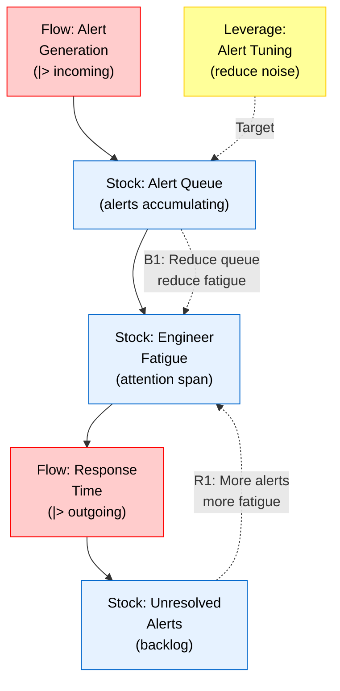
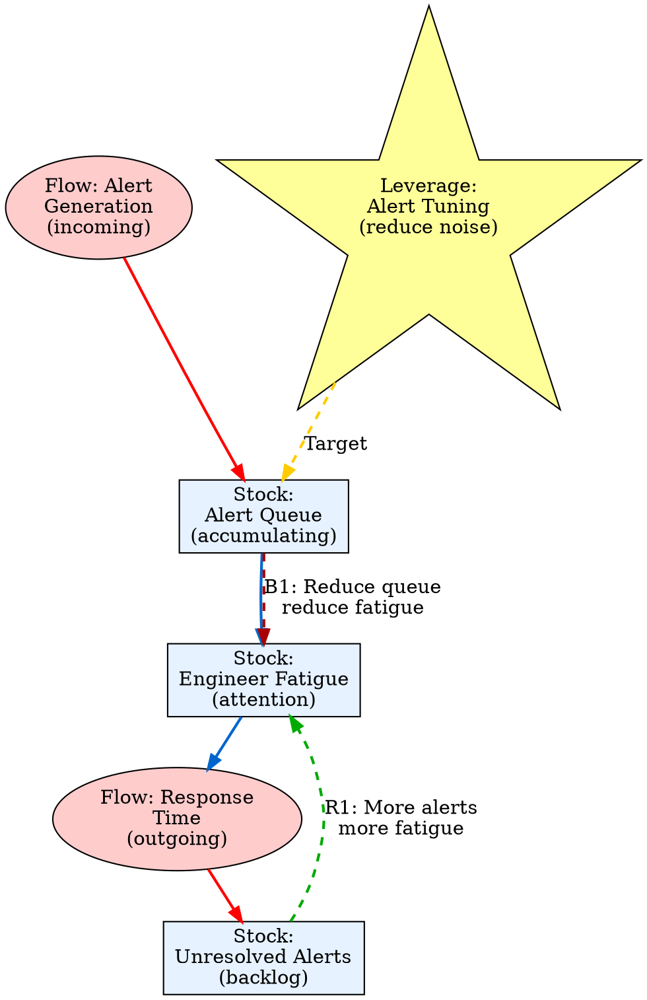
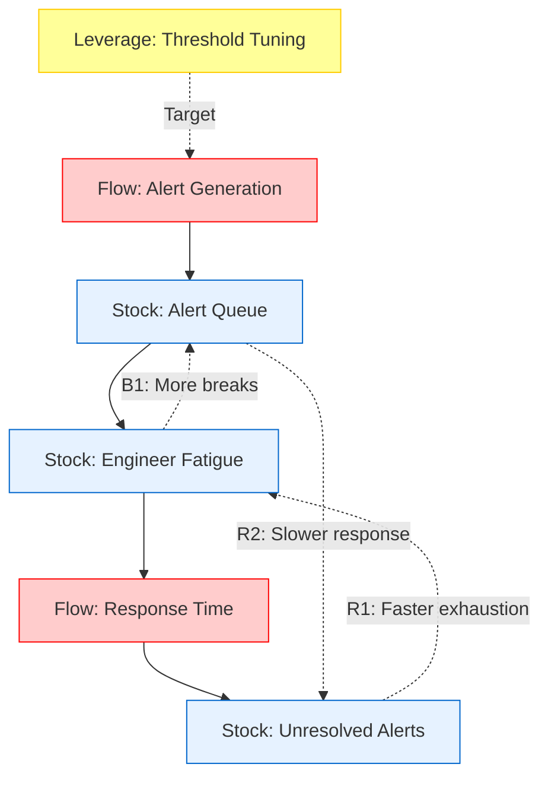
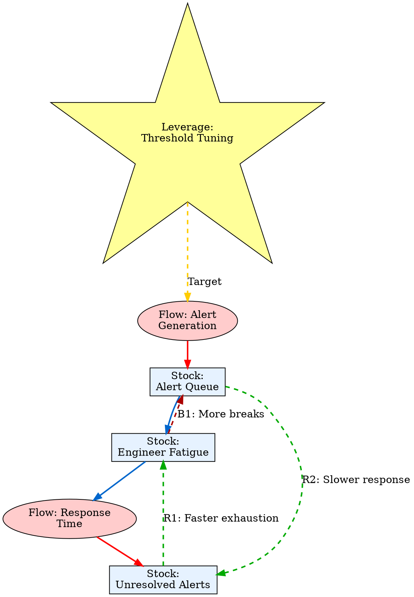

# Visual Grammar: Systems Thinking

How to render a `systemsthinking` thought as a diagram.

## Node Structure

Systems thinking diagrams model feedback loops and causal relationships:
- **Stock** (rectangle with vertical lines on sides, like a tank): accumulating quantity (e.g., alert fatigue level)
- **Flow** (arrow with a valve gate `|>` or bold label): rate of change in a stock
- **Reinforcing loop** (curved arrow, labeled `(R)` or `R1`, `R2`): positive feedback that amplifies change
- **Balancing loop** (curved arrow, labeled `(B)` or `B1`): negative feedback that stabilizes or dampens
- **Leverage point** (yellow star or callout box): intervention point where small changes have large effects

## Edge Semantics

- **Solid arrow** (`→`) — Causal relationship: variable A influences variable B
- **Curved loop arrow** (↪ with label `(R)`) — Reinforcing loop: amplifies deviation from equilibrium
- **Curved loop arrow** (↪ with label `(B)`) — Balancing loop: acts to restore equilibrium
- **Bold arrow** (`⟹`) — High-impact flow: represents the main causal pathway in a feedback loop

## Mermaid Template

## DOT Template

## Worked Example

Based on the on-call alert fatigue scenario from `reference/output-formats/systemsthinking.md`:

### Mermaid

### DOT

## Special Cases

- **Reinforcing loops**: Mark with `(R)` notation and curved arrows in green/teal to show amplification.
- **Balancing loops**: Mark with `(B)` notation and curved arrows in red/orange to show dampening or restoration.
- **Multiple loops**: When the same stock participates in multiple loops, draw all loops separately and label them (e.g., R1, R2, B1) to distinguish them.
- **Time delays**: Annotate edges with a delay indicator (e.g., `[⏱ 2 days]`) if the causal effect takes time to manifest.
- **Archetypes**: If the system exhibits a known archetype (e.g., "Balancing Loop with Delay", "Limits to Growth"), label it at the top or as a callout.
- **Intervention points**: Leverage points should be highlighted as stars or special shapes with a dashed line to the stock or flow they target.

