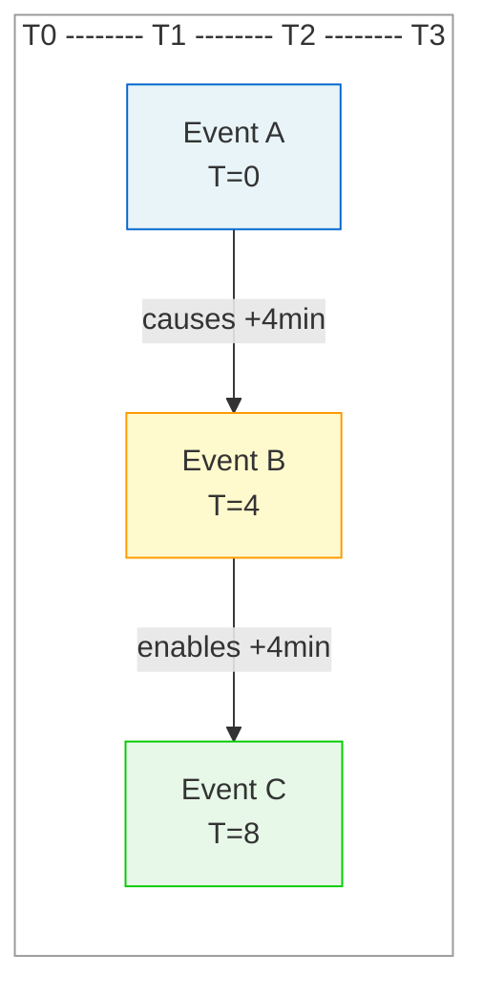
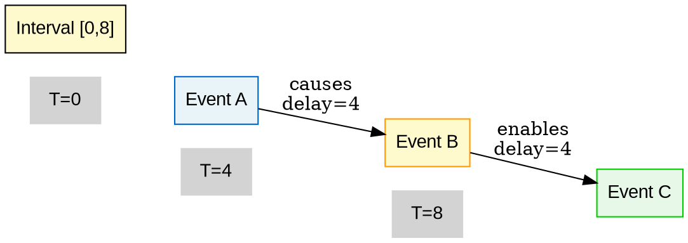
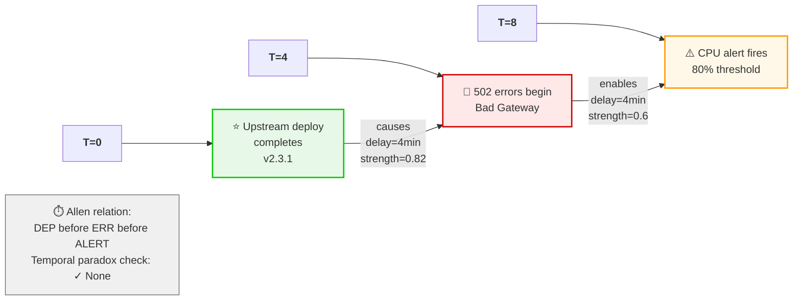
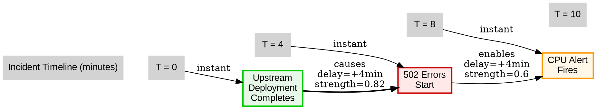

# Visual Grammar: Temporal

How to render a `temporal` thought as a diagram.

## Node Structure

- **Events** → Stadium/pill-shaped nodes on the timeline (timestamp label inside or above)
- **Intervals** → Rectangles spanning the timeline with duration label
- **Timeline axis** → Horizontal line with time unit tick marks
- **Allen relations** → Bracket annotations between events/intervals showing the relation type

## Edge Semantics

- **Causation** → Solid arrow with `causes` label and delay `(+Δt)` annotation
- **Enablement** → Dashed arrow with `enables` label
- **Prevention** → Dashed red arrow with `prevents` label
- **Temporal constraint** → Bracket showing Allen relation (before, meets, overlaps, during, etc.) with confidence score

## Mermaid Template

## DOT Template

## Worked Example

Input: "The 502 error first appeared 4 minutes before the CPU alert. The upstream deployment completed at T+0." (from temporal.md)

**Mermaid:**

**DOT:**

## Special Cases

- **Allen's interval algebra** → For each pair of events/intervals, show the relation in a bracket annotation: `[before]`, `[meets]`, `[overlaps]`, `[during]`, `[equals]`, etc.; use Unicode bracket characters or text labels
- **Circular temporal dependencies** → Show with a loop arrow marked "⚠ Temporal loop"; flag as a potential paradox
- **Unknown timing** → Use dashed edges with "unknown delay" label; confidence value on edge
- **Dense timelines** → Use horizontal stacking with multiple time axes or grid layout; show events as vertical lines crossing the timeline
